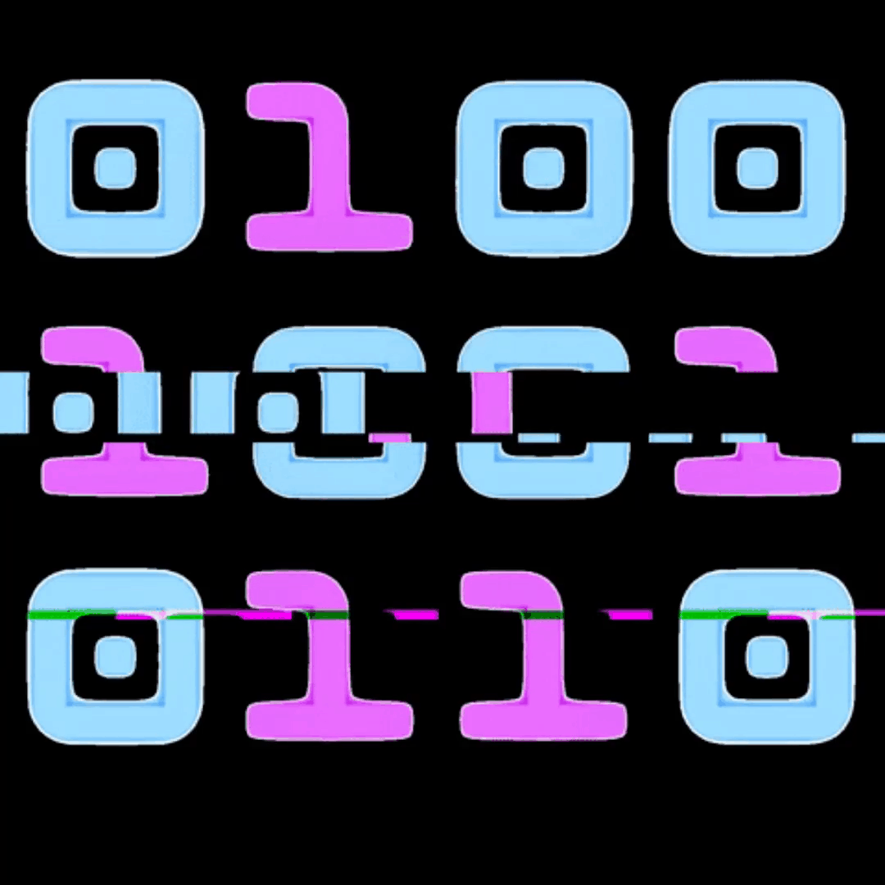

<h1 align="center"></h1>
<h2 align="center">
 

  
  

  
  
</h2>

<table align="right">
<tr>
<td>

[][instagram]
[][facebook] 
[][telegram]

</td>
</tr>
</table>

<h3 align="left"> About me!</h3>
Cybersec enthusiast, driven by curiosity and a deep respect for the art of ethical hacking. I’m passionate about learning, growing, and motivating others who share the same fire for cybersecurity. Whether it's sharing knowledge, exploring new techniques, or supporting beginners, I'm here to build and uplift the community.

### 💻 Computer Engineering Student !!
- 🦾 I love computer security!
- 🤓 I’m currently learning everything
- 👾 I'm very curious and that is why you start studying programming
- 🗒 I'm currently very obsessed with learning computer security and programming.

Are you ready to embark on a journey full of fascinating challenges and discoveries in the vast cyberspace?
 

---

  <h3> Skills</h3>

  <!-- Lenguajes -->
  
  
  
  <!-- DataBase -->
  
  <!-- OS -->
  
  
  <!-- Cybersecurity Tools -->
  
  
  
  
  <!-- Privacy/Browsers -->
  
  

---

<h2> Stats and Activity</h2>

  <h3>🔥 Streak Stats</h3>

  

    
    
  

  <h3>💻 GitHub Profile Stats</h3>

  

    
    
  

 

> [!NOTE]
> **Top languages** is only a metric of the languages my public code consists of and doesn't reflect experience or skill level.

 

  

---
### GitHub Profile Trophy 🏆

  

[instagram]: https://www.instagram.com/Ch4rum/
[facebook]: https://www.facebook.com/profile.php?id=100066815058123
[telegram]: https://t.me/+7cD7_cUrfbI2NmYx
